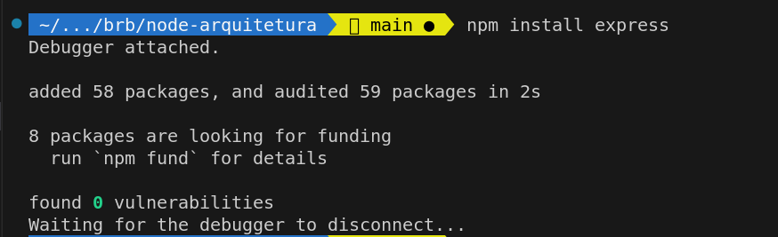
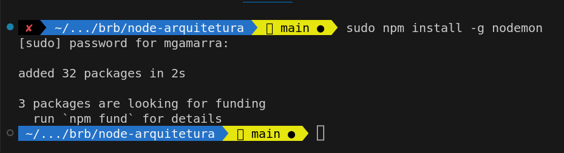
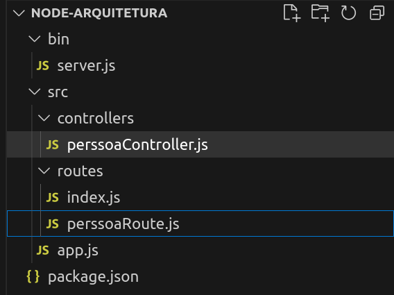
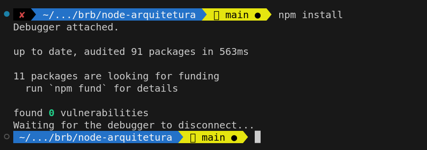
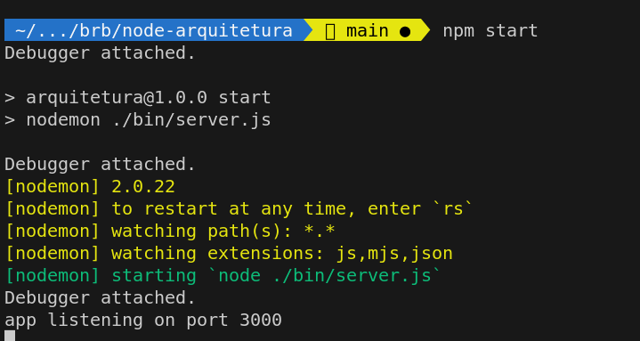
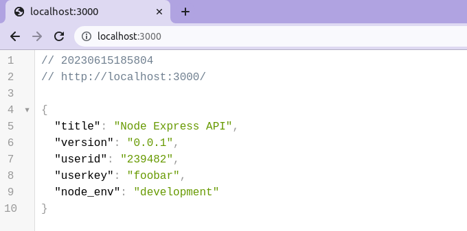
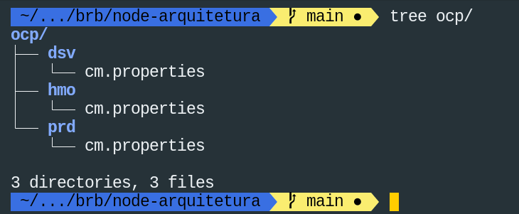

# Proposta de arquitetura para aplicações em Node.js e express

# Pré requisitos
Node instalado e configurado na computador.

## Inicialização do projeto
Na sequencia deve-se criar o arquivo package.json, esse é o arquivo de ponto de partida de projetos Node.js. 
Execute o comando abaixo para inicializar um projeto Node.js.

```bash
npm init -y
```
## Express

O Express é um framework web para Node.js que simplifica a criação de aplicativos web e APIs. Ele permite definir rotas, manipular solicitações e respostas HTTP, gerenciar sessões e criar middlewares. O Express é amplamente adotado devido à sua simplicidade, flexibilidade e grande comunidade de desenvolvedores. Ele suporta plugins e middlewares, oferecendo recursos adicionais, como autenticação, manipulação de arquivos estáticos e muito mais
Execute o comando abaixo para adicionar o express a um projeto Node.js.

```bash
npm install express 
```
[]()

## Nodemon

O Nodemon é uma ferramenta de desenvolvimento para aplicações Node.js. Ele monitora os arquivos do projeto em tempo real e reinicia automaticamente o servidor sempre que ocorre uma alteração nos arquivos. Isso elimina a necessidade de parar e reiniciar manualmente a aplicação a cada alteração no código, tornando o processo de desenvolvimento mais eficiente.

Execute o comando abaixo para instalar o nodemon no projeto.

```bash
npm install -g nodemon
```
[]()

Adicione o comando abaixo na seção scripts do package.json do projeto.
```
start": "nodemon ./bin/server.js"
```
O arquivo package.json deve estar parecido com o exemplo abaixo.
```js
{
  "name": "node-arquitetura",
  "version": "1.0.0",
  "description": "#",
  "main": "index.js",
  "scripts": {
    "test": "echo \"Error: no test specified\" && exit 1",
    "start": "nodemon ./bin/server.js"
  },
  "keywords": [],
  "author": "",
  "license": "ISC",
  "dependencies": {
    "express": "^4.18.2",
    "nodemon": "^2.0.22"
  }
}

```

## Estrutura do projeto
Crie uma estrutura de pastas e arquivos conforme a imagem a baixo:
[]()


## Server
Arquivo é responsável pela inicialização e execução da aplicação.

**bin/server.js**
```js
// Carrega as configurações da aplicação 
const dotenv = require('dotenv').config();
const app = require('../src/app');

const port = normalizaPort(process.env.PORT || '3000');

function normalizaPort(val) {
    const port = parseInt(val, 10);
    if (isNaN(port)) {
        return val;
    }

    if (port >= 0) {
        return port;
    }

    return false;
}

app.listen(port, function () {
    console.log(`app listening on port ${port}`)
})
```
No código a cima estão definidos os seguintes passos:
- Import e configuração do módulo **dotenv** para leitura de variáveis da aplicação;
- Import de um modulo a ser criado nos próximos passos;
- Definição da porta em que a aplicação será executada. O valor é lido da váriavel de ambiente. Caso não esteja definida essa váriavel é utilizado um valor padrão.

- Passagem para o método app.listen da porta que da que a aplicação será executada um console.log com ela.

## Controllers

No padrão MVC, os controllers são responsáveis por gerenciar as interações do usuário, atualizar o modelo de dados e atualizar a visualização correspondente.

**src/controllers/perssoaController.js**
```js
exports.get = (req, res, next) => {
    res.status(200).send('Requisição recebida com sucesso!');
};

exports.getById = (req, res, next) => {
    res.status(200).send('Requisição recebida com sucesso!');
};

exports.post = (req, res, next) => {
    res.status(201).send('Requisição recebida com sucesso!');
};

exports.put = (req, res, next) => {
    let id = req.params.id;
    res.status(201).send(`Requisição recebida com sucesso! ${id}`);
};

exports.delete = (req, res, next) => {
    let id = req.params.id;
    res.status(200).send(`Requisição recebida com sucesso! ${id}`);
};
```
## Routes
No padrão MVC , as rotas são responsáveis por mapear as URLs das requisições HTTP para os controladores apropriados. 

O arquivo pessoaRoute.js contem as rotas que iremos utilizar para nossa PessoaController.

**src/routes/index.js**
```js
const express = require('express');
const router = express.Router();

router.get('/', function (req, res, next) {
    res.status(200).send({
        title: "Node Express API",
        version: "0.0.1"
    });
});

module.exports = router;
```

**src/routes/perssoaRoute.js**
```js
const express = require('express');
const router = express.Router();
const controller = require('../controllers/perssoaController')

router.get('/', controller.get);
router.get('/:id', controller.getById);
router.post('/', controller.post);
router.put('/:id', controller.put);
router.delete('/:id', controller.delete);

module.exports = router;
```

## Configurações
O arquivo app.js é responsável pelas configurações do projeto. Nele devem ser adicioandas as configurações nessárias a execução da aplicação. Ex:  configuraçoes de banco de dados, rotas, etc.

>> Em Node.js, o uso process.env para configuração de aplicações é uma boa prática devido à flexibilidade de que oferece, permitindo que as configurações sejam facilmente ajustadas em diferentes ambientes de execução. Além disso, o process.env proporciona segurança para informações sensíveis, como senhas e chaves de API, evitando que sejam expostas no código-fonte. Com a utilização de variáveis de ambiente, o aplicativo se torna mais portátil e escalável, possibilitando a configuração em diferentes instâncias sem a necessidade de modificar o código. É uma maneira conveniente de ajustar as configurações do aplicativo sem a necessidade de recompilar ou reiniciar o servidor.

### Instalação do pacote dotenv

Execute o comando abaixo para instalar o dotenv no projeto.
```bash
npm install dotenv
```
[]()

Para o desenvolvimento local deve-se criar o arquivo **.env** no diretorio raiz do projeto.

**.env** 
```bash
USER_ID="239482"
USER_KEY="foobar"
NODE_ENV="development"
```
*Exemplo que arquivo **.env** com configurações para execução local.*

O arquivo index.js apresenta um exemplo que como ler as váriveis da aplicação.

**src/routes/index.js**
```js

const express = require('express');
const router = express.Router();

router.get('/', function (req, res, next) {

    user_id = process.env.USER_ID;
    user_key = process.env.USER_KEY;
    node_env = process.env.NODE_ENV;

    res.status(200).send({
        title: "Node Express API",
        version: "0.0.1",
        userid: user_id ,
        userkey: USER_KEY,
        node_env: node_env
    });
});

module.exports = router;
```
*Exemplo que leitura de variáveis de ambiente .*


**src/app.js**
```js
const express = require('express');
const app = express();

//Rotas
const index = require('./routes/index');
const perssoaRoute = require('./routes/perssoaRoute');
const probeLivenessRoute = require('./routes/probeLivenessRoute');
const probeReadinessRoute = require('./routes/probeReadinessRoute');
const probeStartupRoute = require('./routes/probeStartupRoute');

app.use(express.json())
app.use(express.urlencoded({ extended: true }))

app.use('/', index);
app.use('/perssoa', perssoaRoute);
app.use('/livez', probeLivenessRoute);
app.use('/readyz', probeReadinessRoute);
app.use('/startup', probeStartupRoute);

module.exports = app;
```


## Probes Liveness, Readiness e Startup 
Probes são mecanismos utilizados no Kubernetes e Openshift para monitorar a disponibilidade da aplicação.

### Liveness Probe
Monitora se a aplicação está saudável, reiniciando a mesma se necessário.

### Readiness Probe
Monitora se a aplicação está pronta para receber requisições, removendo-a temporariamente do balanceamento de carga se não estiver.

### Startup Probe
Monitora se a aplicação está em processo de inicialização, aguardando sua conclusão antes de considerá-lo pronto.

**src/routes/probeLivenessRoute.js**
```js
const express = require('express');
const router = express.Router();

router.get('/', function (req, res, next) {
    // implementar lógica para validar se a aplicação está saudável.
    res.status(200).json({ status: "ok livez" })
});

module.exports = router;
```

**src/routes/probeReadinessRoute.js**
```js
const express = require('express');
const router = express.Router();

router.get('/', function (req, res, next) {
    // implementar lógica para validar se a aplicação está pronta para receber requisições.
    res.status(200).json({ status: "ok readyz" })
});

module.exports = router;
```

**src/routes/probeStartupRoute.js**
```js
const express = require('express');
const router = express.Router();

router.get('/', function (req, res, next) {
    // implementar lógica para validar se a aplicação está ja completou o processo de startup .
    res.status(200).json({ status: "ok startup" })
});

module.exports = router;
```
app.js atualizado com as novas rotas

**src/app.js**
```js
const express = require('express');
const app = express();

//Rotas
const index = require('./routes/index');
const perssoaRoute = require('./routes/perssoaRoute');
const probeLivenessRoute = require('./routes/probeLivenessRoute');
const probeReadinessRoute = require('./routes/probeReadinessRoute');
const probeStartupRoute = require('./routes/probeStartupRoute');

app.use(express.json())
app.use(express.urlencoded({ extended: true }))

app.use('/', index);
app.use('/perssoa', perssoaRoute);
app.use('/livez', probeLivenessRoute);
app.use('/readyz', probeReadinessRoute);
app.use('/startup', probeStartupRoute);

module.exports = app;
```

## Download de dependências e execução

Para a execução da aplicação, digite o comando npm install na  console para importar os pacotes necessários para a aplicação e na sequencia execute o comando npm start.

```bash
npm install
```
[]()

```bash
npm start
```
[]()

Abra no seu navegador o endereço http://localhost:3000/. Ele deve apresentar a mensagem a baixo como retorno da nossa rota Index.

[]()


## Externalização das Configurações
Em Kubernetes, as configurações da aplicação devem ser externalizadas visando maior flexibilidade, portabilidade, segurança e facilidade de gerenciamento.

As configurações são externalizadas através de ConfigMaps e Secrets.
ConfigMaps são usados para armazenar configurações não sensíveis e Secrets são usados para informações confidenciais. ConfigMaps são adequados para variáveis de ambiente e arquivos de configuração, enquanto Secrets são usados para senhas, chaves e certificados criptografados. 

Em ambos os casos as informações são acessadas por aplicações Node.js através do **process.env** 


As informações dos ConfigMaps serão armazedas junto ao código da aplicação de acordo com o ambiente de execução.

Crie a seguinte estrutura de pastas no diretório raiz do projeto.
[]()